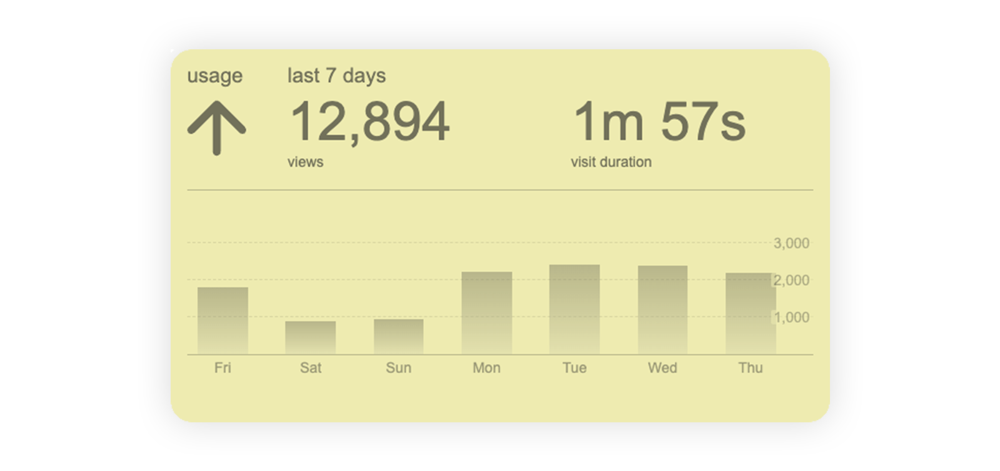
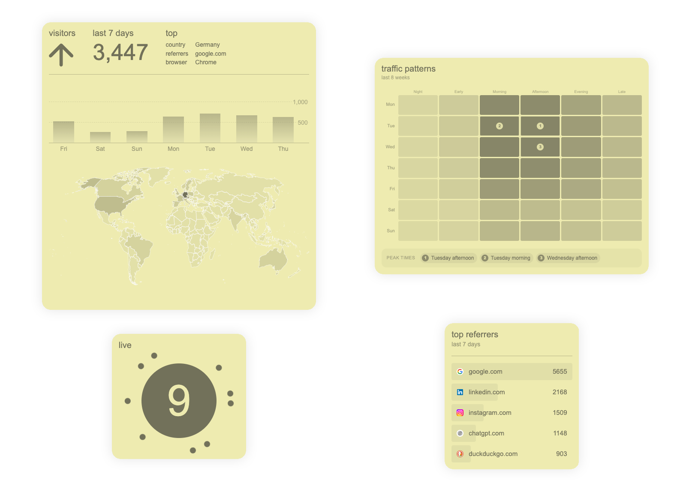
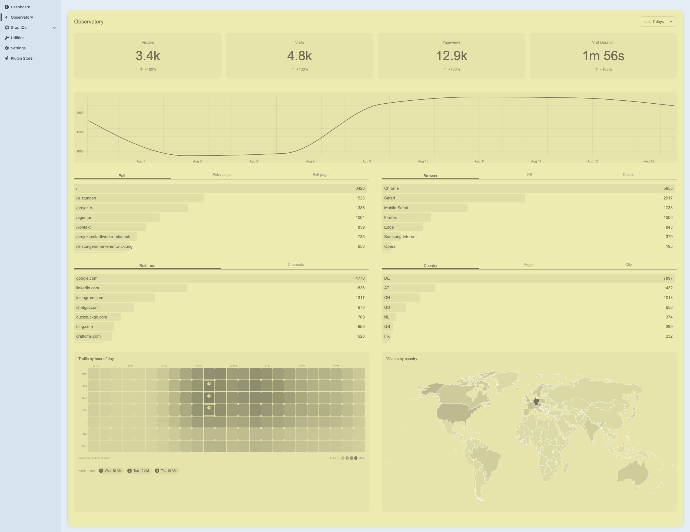

<br />

<div align="center"><strong>observatory: see who's out there.</strong></div>


<div align="center"><strong>PostHog analytics, native to the Craft CMS control panel.</strong></div>
<div align="center">Stop switching tabs. Observatory pulls your PostHog data into a dedicated control panel section and a set of dashboard widgets.</div>

<br />
<div align="center">
  <sub>Made possible by</sub>
  <sub><br />
  <a href="https://www.szenario-design.com/" target="_blank">
    </a>
  </sub><br /><br />
  <sub>The team behind the magic</sub><br />
  <sub><a href="https://twitter.com/smonist">Simon Wesp</a></sub>
  <sub><a href="https://twitter.com/thomasbendl">Thomas Bendl</a></sub>
  <sub>Erich Bendl</sub>
</div>

<br />

<div align="center"><i>This plugin is free via the Craft Plugin Store.</i></div>

## Features ✨

- Dedicated observatory section in the control panel with chart, KPIs and breakdowns
- Nine dashboard widgets covering the most common needs.
- Automatic background sync via the Craft queue, plus CLI commands for manual pulls

## Requirements 📋

- Craft CMS `5.0.0+`
- PHP `8.2+`
- A PostHog project and a personal API key with read access
- A running Craft queue runner for background syncing (CRON or daemon)

## Installation 📦

### Plugin Store
[Install observatory from the Craft Plugin Store](https://plugins.craftcms.com/observatory)

### Composer

```bash
composer require szenario/craft-observatory
php craft plugin/install observatory
```

## Quickstart 🚀

1. Open Settings → Plugins → Observatory
2. Enter your PostHog host, project ID and personal API key
3. After the initial sync, you are good to go!

## Screenshots

<br />



## Console Commands

Syncing runs automatically in the background, so this command is optional — useful as a cron
entry point to keep the mirror warm, or to rebuild stored data.

```bash
# pull any missing closed days (default 30) into the local mirror
php craft observatory/sync

# cover a longer window
php craft observatory/sync 90

# refetch days already recorded as synced
php craft observatory/sync 90 --force
```

## Support

- Issues: https://github.com/szenario-fordesigners/craft-observatory/issues
- Source: https://github.com/szenario-fordesigners/craft-observatory
- Developer: https://www.szenario-design.com/

---

**Created by [szenario.design](https://www.szenario-design.com/)**
